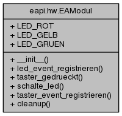

ea_rpi_modul
============

Bei dem Projekt handelt es sich um eine Python Bibliothek für ein E/A-Modul
(Eingabe-Ausgabe-Modul) für den Raspberry Pi.

Installation
============

Das Modul liegt im Python-Package-Index (PyPi) unter dem Namen
[eapi](https://pypi.python.org/pypi/eapi). Es kann mit `sudo pip3 install eapi`
installiert werden. Wenn die Installation nur lokal für einen User erfolgen
soll, heißt der Befehl `pip3 install --user eapi`.

Unter Windows gibt es kein `sudo`. Daher kann dieser Befehl unter Windows
entfallen.

Upgrade
-------

Wenn die Bibliothek bereits installiert ist aber nur in einer älteren Version
vorliegt, kann sie mit dem Befehl `sudo pip3 install --upgrade eapi` auf den
neuesten Stand gebracht werden.

Klasse EAModul
==============

Mit Hilfe der Klasse `EAModul` können die Taster und LED einfach angesteuert
bzw. ausgelesen werden.

    from eapi.eapi import EAModul     #0

    ea = EAModul(29, 31, 33, 35, 37)  #1
    ea.schalte_led(0, True)           #2
    ea.schalte_led(0, False)          #3
    
    if ea.taster_gedrueckt(0):        #4
        print("Taster 0 gedrückt")
        
    ea.cleanup()                      #5

**#0** Aus dem Modul `eapi.eapi` wird die Klasse `EAModul` importiert.

**#1** Bei der Initialisierung müssen die auf dem RaspberryPi verwendeten PINs
angegeben werden: zuerst die beiden Pins für die Taster, es folgen drei
Pins für die LED.

**#2 und #3** Die LED sind durchnummeriert (beginnend bei 0) und können ein
oder ausgeschaltet werden. Hier wird die LED mit der Nummer 0 erst ein- und
dann wieder ausgeschaltet.

**#4** Der Zustand des Tasters mit der Nummer 0 wird abgefragt. Die Taster
sind nummeriert (beginnend bei 0).

**#5** Mit der Methode `cleanup()` werden die Pins des Pi wieder auf den
Ausgangszustand zurückgesetzt.

Beispiel 2
----------

In einem weiteren Beispiel können wir sehen, wie man auf das Drücken eines
Tasters reagiert. Die rote und grüne LED blinken fortwährend im Wechsel. Wenn
man während des Programmablaufes irgendwann auf den Taster 1 drückt, beendet
sich das Programm. Über den Taster 0 kann die gelbe LED an- und beim
Loslassen des Tasters wieder ausgeschaltet werden.

    from eapi.eapi import EAModul
    import time

    ea_modul = EAModul()                                     #1

    def taster0_gedrueckt(pin):                              #2
        global ea_modul
        ea_modul.schalte_led(EAModul.LED_GELB, ea_modul.taster_gedrueckt(0))

    ea_modul.taster_event_registrieren(0, taster0_gedrueckt) #3

    try:
        while not ea_modul.taster_gedrueckt(1):              #4
	        ea_modul.schalte_led(EAModul.LED_ROT, True)
            time.sleep(0.2)
		    ea_modul.schalte_led(EAModul.LED_ROT, False)
            time.sleep(0.2)

            ea_modul.schalte_led(EAModul.LED_GRUEN, True)
            time.sleep(0.5)
		    ea_modul.schalte_led(EAModul.LED_GRUEN, False)
            time.sleep(0.2)

    except KeyboardInterrupt:
        ea_modul.cleanup()
    finally:
        ea_modul.cleanup()

**#1** Das Modul wird mit der Standardbeschaltung initialisiert. Hierbei sind
die PINs der Reihe nach an den Pins 29, 31, 33, 35 und 37 angeschlossen.

**#2** Die Methode wird aufgerufen, sobald der Taster 0 gedrückt wird. Damit
dies passiert, wird sie gleich dafür registriert.

**#3** Die Methode wird für den Taster 0 registriert und aufgerufen, sobald
der Taster gedrückt wird.

**#4** Der Taster wird in einer Schleife immer wieder abgefragt. Solang der
Taster zum Zeitpunkt der Abfrage nicht gedrückt ist, läuft die Schleife weiter.

Hilfe erhalten
--------------

Der Quelltext ist gut dokumentiert. Man kann sich die Hilfe der Klasse
`EAModul` innerhalb des Python Interpreters mit dem Befehl `help(EAModul)`
anzeigen lassen. Auf der Kommandozeile hilft der Befehl `pydoc3` weiter. Mit
`pydoc3 eapi.eapi` oder `python3 -m pydoc eapi.eapi` wird die Dokumentation
für das Modul angezeigt. 

Verwendung ohne Raspberry Pi
============================

Die Bibliothek ist für die Verwendung mit dem Raspberry Pi konzipiert. Wenn
jedoch kein Pi angeschlossen ist, wird eine Bibliothek mit Dummyfunktionen
geladen. Diese gibt für die Eingänge (Taster) zufällige Werte zurück. Bei
Ausgaben (LED) auf den Ausgängen erfolgt eine Textausgabe auf der Konsole.

Fehler oder Bugs
================

Du hast einen Fehler oder Bug gefunden? Dann erstelle bitte einen
Bugreport. Dafür musst du oben auf "Issues" und dann auf "New Issue"
klicken. Danach kannst du alle Details angeben.

