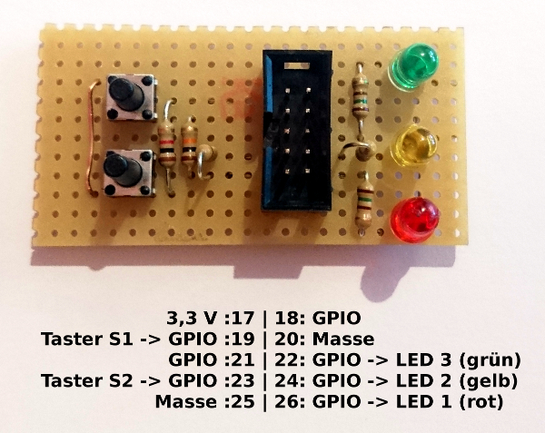

Hardware
========

Das E/A-Modul ist eine kleine Platine, die über zwei Taster für Eingaben und drei Leuchtdioden für Ausgaben verfügt. Die Ansteuerung erfolgt über die GPIO-Schnittstelle des Raspberry Pi.

Das Modul wird an fünf GPIO-Pins angeschlossen und benötigt zusätzlich einen 3,3-V-Pin und einen Masse-Pin für die Spannungsversorgung.

Taster
------
Die Eingabepins werden jeweils über einen Pulldownwiderstand (R2 = R3 = 10 kΩ) auf Massepotential gelegt. Nach Betätigung eines Tasters wird der jeweilige Eingabepin über den Widerstand R1 = 1 kΩ mit den 3,3 V verbunden. Durch den Spannungsteiler ergibt sich am Pin ein Potential von etwa 3 V, welches sicher als 1-Signal erkannt wird.

LED
---
Die Leuchtdioden werden direkt von den Ausgabepins der GPIO Schnittstelle mit einer Spannung von 3,3 V versorgt. Die Vorwiderstände R4 = R5 = R6 = 150 Ω begrenzen den Strom.

Zwei Varianten
==============

Es gibt zwei Varianten des E/A-Moduls. Im Wesentlichen Unterscheiden sich die Varianten in den Anschlussmöglichkeiten.

Variante mit Stiftleiste
------------------------

Die erste Variante wird über eine Stiftleiste an den Raspberry Pi angeschlossen. Dazu werden sieben Jumperwire (female-female) benötigt. Die GPIO-Pins des Raspberry Pi können frei gewählt werden.

Variante mit Wannenstecker
--------------------------

Die zweite Variante verfügt über einen 10-poligen Wannenstecker. Das Modul wird mithilfe eines Flachbandkabels am Raspberry Pi angeschlossen. Bei dieser Variante werden die Pins 17 bis 26 der GPIO Schnittstelle belegt. Zur Spannungsversorgung dienen der Pin 17 (3,3 V) sowie die Pins 20 und 25 (Masse). Als Eingabepins für die Taster werden die Pins 19 und 23 (GPIO 10 und 11) verwendet. Als Ausgabepins für die Leuchtdioden werden die Pins 22, 24 und 26 (GPIO 25, 8 und 7) verwendet.

Vor- und Nachteile der Varianten
--------------------------------

Vorteilhaft an der Variante mit Wannenstecker ist, dass man das Modul relativ schnell mit dem Raspberry Pi verbinden kann. Sie ist allerdings noch nicht ganz ausgereift, da ein 10-poliger Pfostenverbinden (der Stecker am Flachbandkabel) nicht ohne Weiteres auf die 40-polige Stiftleiste des Raspberry Pi passen. Abhilfe schafft eine 2x5-polige, stapelbare Buchsenleiste, die allerdings nicht so einfach erhältlich ist. Alternativ kann ein 40-poliges Flachbandkabel verwendet werden, wodurch allerdings alle 40 Pins des Raspberry Pi belegt sind.
